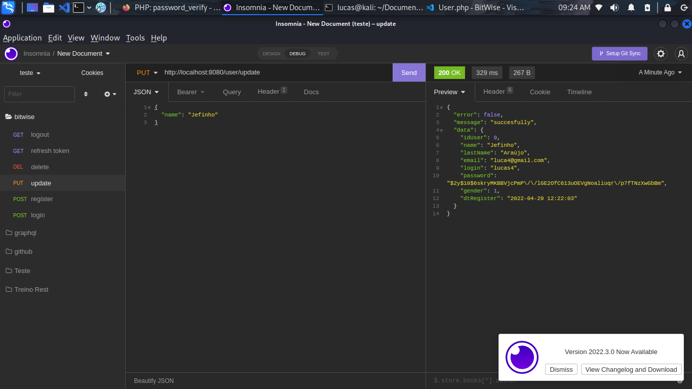
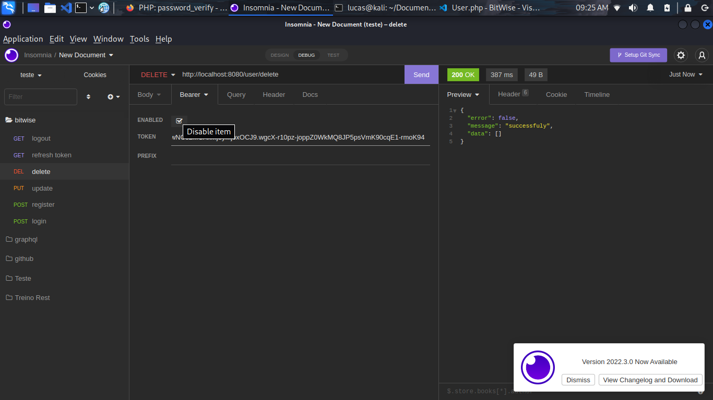
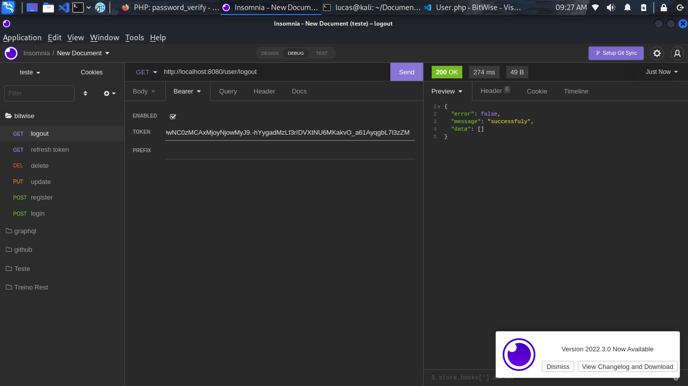

# Sistema-de-Login - Meu projeto pessoal de gestão de atividades pessoais

## O que é o projeto

O projeto é uma API de login de usuários, sendo necessário fazer o registro e login,
para que seja gerado e retornado o token de acesso. Com o token em mãos terá acesso aos
demais endpoints do CRUD.

## Principais funcionalidades

### Cadastro de cliente

Acessado pelo endpoint http://localhost:8080/register.

### Login

Acessado pelo endpoint http://localhost:8080/login.

### Atualização dos dados do clientes

Acessado pelo endpoint http://localhost:8080/user/update, com o Bearer Token.

### Excluir cadastro.

Acessado pelo endpoint http://localhost:8080/user/delete, com o Bearer Token.

### Fazer o logout.

Acessado pelo endpoint http://localhost:8080/user/logout, com o Bearer Token.

### Recuperar token expirado.

Acessado pelo endpoint http://localhost:8080/refresh_token, com o Bearer Token.

## Como executa-lo

Se você for um programador, faça os seguintes passos:

1) executar no shell: composer install.
2) criar o arquivo env.php.
3) criar o arquivo .env.
4) executar no shell: docker-compose up -d

## Diário de bordo

### Dia 1 - 27/04/2022

Neste dia eu fiz:

* Criei o README.md, pois já tinha o projeto todo feito em minha máquina.

A minha principal dificudade foi entender a nomeclatura e a dinâmica desse arquivol.